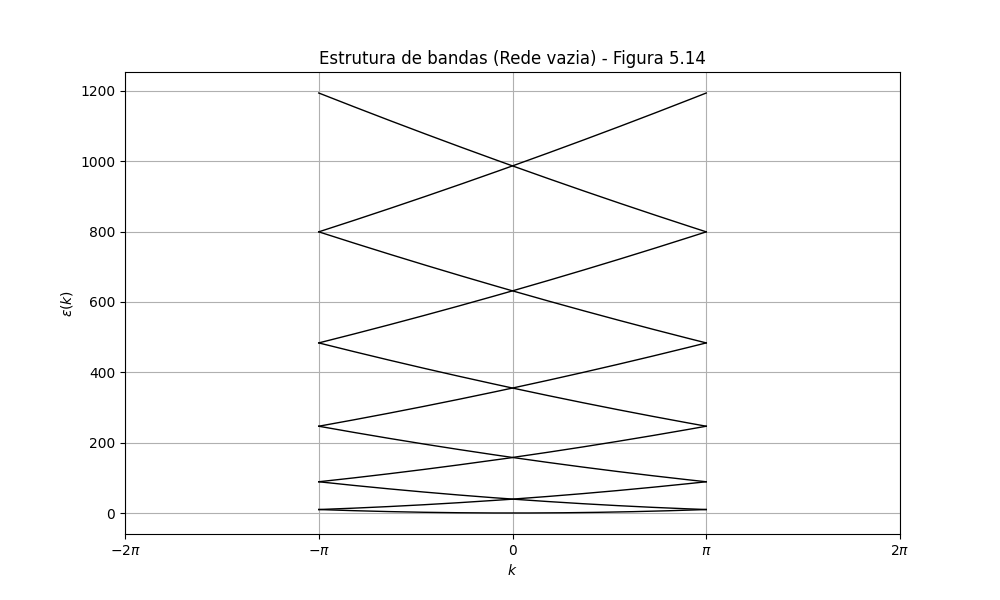
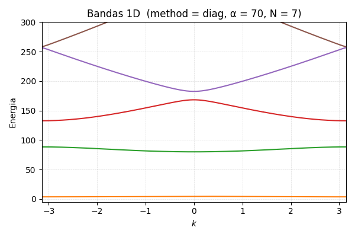
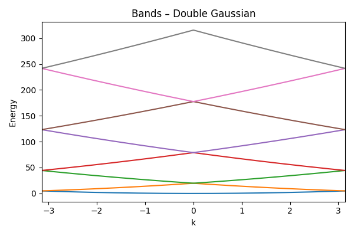
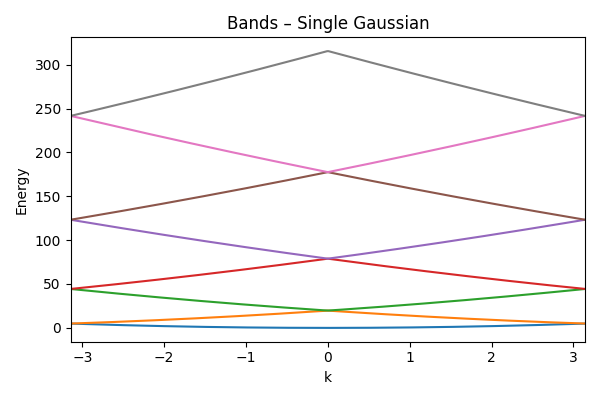

# Atividade 06

Exercício 1 - Caso 1D simples
Considere um cristal 1D para reproduzirmos as Figuras 5.14 e 5.17 das notas de aula do Rodrigo Capaz. Sendo que esta última figura refere-se à Figura 9.4 do livro Ashcroft & Mermin

então, a partir desse treino, usar NN para derivar funções trigonométricas.
O exito foi obtido limitando a rede neural a treinar apenas expoentes pares com coeficientes pares
e coeficientes ímpares com expoentes ímpares.

Escolha uma função para V ( x ) que respeite V ( x ) = V ( x + R ) com R = 1 .

